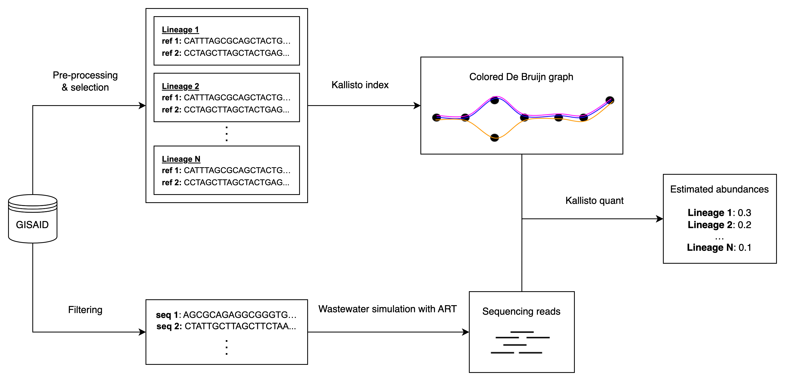

This repository contains code used for the SARS-CoV-2 variant abundance estimation using the VLQ pipeline [1] in simulated wastewater data.

Various experiments are performed to determine the influence of reference set design choices on the accuracy of abundance estimation. The relevant scripts and other files for the experiments performed can be found under the folder  `experiments`. 

Specifically, we examine the impact of various sequence properties such as source location, collection date, observed allele frequencies, and N-content on prediction accuracy of SARS-CoV-2 lineages in simulated wastewater data. Additionally, we investigate how excluding older sequences can potentially improve abundance predictions. We perform predictions at different levels of granularity to identify when abundance estimates are most reliable. Finally, we perform an experiment in which predictions are made with just a subset of available reference sequences and use multiple sequences to simulate the lineage to be measured in another experiment to test prediction ability in more realistic settings. 

## Workflow and Scripts
1. Within the experiment folders the files `build_reference_sets.sh` (or similarly named) are used to run the pre-processing and selection for a given dataset as well as build the Kallisto index based on the selected reference sequences. 

2. Within the experiment folders the files `produce_ww.sh` (or similarly named) are used to produce the simulated wastewater data given a dataset and the sequence(s) of the lineage/VOC to be measured at different simulated abundances.

3. Within the folder `experiment_scripts` the files `run_kallisto_ref_sets.sh` (or similarly named) are used to produce the abundance estimates given the simulated wastewater data (step 2) and the kallisto index (step 1). 

4. Finally to process the output of step 3 (abundance quantification), the files `output_predictions.sh` (or similarly named) found within the folders of each experiment need to be run. 

Notes:
1. Helper scripts are found in `utils`.
2. `who` within file names denotes abundance estimates made at the VOC level instead of the lineage level.
3. Files related to the VLQ pipeline are found in the `pipeline` folder while their adjusted version for the `next regions` datasets is found in `experiment_scripts/global_next_regions`.

The workflow is summarised in the figure below: 

## Referenes

[1] Jasmijn A. Baaijens, Alessandro Zulli, Isabel M. Ott, Ioanna Nika, Mart J. van der Lugt, Mary E.
Petrone, Tara Alpert, Joseph R. Fauver, Chaney C. Kalinich, Chantal B.F. Vogels, Mallery I.
Breban, Claire Duvallet, Kyle A. McElroy, Newsha Ghaeli, Maxim Imakaev, Malaika F. Mckenzie-
Bennett, Keith Robison, Alex Plocik, Rebecca Schilling, Martha Pierson, Rebecca Littlefield,
Michelle L. Spencer, Birgitte B. Simen, Ahmad Altajar, Anderson F. Brito, Anne E. Watkins,
Anthony Muyombwe, Caleb Neal, Chen Liu, Christopher Castaldi, Claire Pearson, David R.
Peaper, Eva Laszlo, Irina R. Tikhonova, Jafar Razeq, Jessica E. Rothman, Jianhui Wang, Kaya
Bilguvar, Linda Niccolai, Madeline S. Wilson, Margaret L. Anderson, Marie L. Landry, Mark D.
Adams, Pei Hui, Randy Downing, Rebecca Earnest, Shrikant Mane, Steven Murphy, William P.
Hanage, Nathan D. Grubaugh, Jordan Peccia, and Michael Baym. Lineage abundance estimation
for sars-cov-2 in wastewater using transcriptome quantification techniques. Genome Biology, 23,
12 2022
